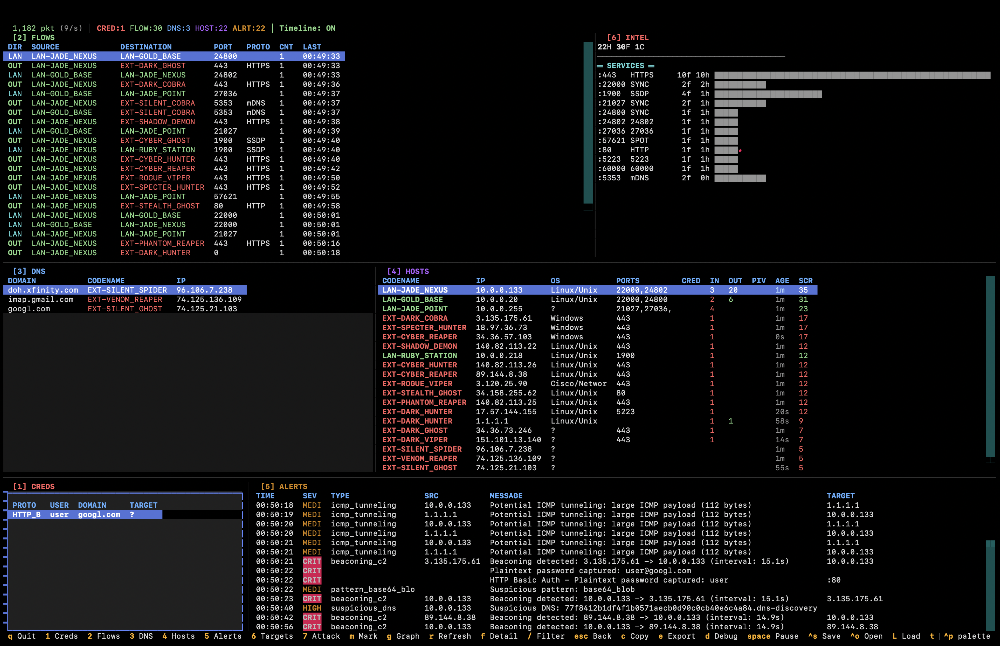
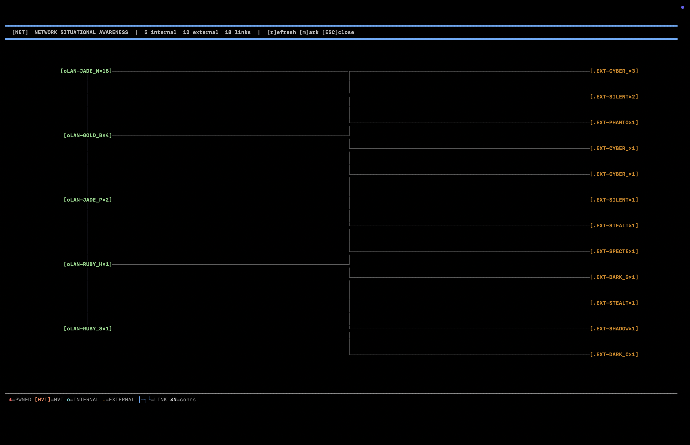

# PCAP-Intel v2.1 "SHADOW_SERPENT"

Real-time network traffic intelligence TUI for red team operators and security analysts. Extracts credentials from **38 protocols** in real time with hashcat-ready output.

```
+==============================================================================+
|  [NET]  PCAP-INTEL v2.1  |  SHADOW_SERPENT  |  Real-Time Network Intel       |
+==============================================================================+
```

## Screenshots

### Main Dashboard

*Multi-panel real-time analysis: Flows, DNS, Hosts, Credentials, Alerts, and Intel summary*

### Network Graph

*ASCII network topology with connection mapping and compromise indicators*

## Requirements

- **Python 3.10+**
- **tshark 4.x** (Wireshark CLI) - must be in PATH
- Root/sudo for live capture (interface sniffing)

### Install tshark

```bash
# Debian/Ubuntu/Kali
sudo apt install tshark

# macOS
brew install wireshark

# Arch
sudo pacman -S wireshark-cli

# Verify
tshark --version
```

## Installation

### From Source (recommended)

```bash
git clone https://github.com/veil-protocol/pcap-intel.git
cd pcap-intel
pip install -e .
```

### Quick Run (no install)

```bash
git clone https://github.com/veil-protocol/pcap-intel.git
cd pcap-intel
pip install textual rich cryptography
python -m pcap_intel.streaming.tui -r capture.pcap
```

## Usage

### Analyze a PCAP file
```bash
pcap-intel -r capture.pcap
```

### Live capture
```bash
sudo pcap-intel -i eth0
```

### Live capture with BPF filter (recommended for busy networks)
```bash
sudo pcap-intel -i eth0 -f "tcp port 445 or tcp port 80 or tcp port 21"
```

### Debug mode
```bash
pcap-intel -r capture.pcap -d
```

### Run without installing
```bash
python -m pcap_intel.streaming.tui -r capture.pcap
python -m pcap_intel.streaming.tui -i eth0
```

## Supported Protocols (38)

### Enterprise Authentication
| Protocol | Extracted | Hashcat Mode |
|----------|-----------|--------------|
| NTLMv1 | user::domain:lm:nt:challenge | 5500 |
| NTLMv2 | user::domain:challenge:ntproofstr:blob | 5600 |
| Kerberos AS-REP | $krb5asrep$23$user@realm | 18200 |
| Kerberos TGS-REP | $krb5tgs$23$*user$realm$spn* | 13100 |
| HTTP Basic | **plaintext password** | - |
| HTTP Digest | user:realm:response | 11400 |
| HTTP Bearer | bearer token | - |
| LDAP Simple | **plaintext password** | - |
| RADIUS | Access-Request hash | 16000 |
| TACACS+ | authentication hash | 16100 |
| Diameter | 3GPP AAA | - |
| DCE/RPC | NTLM over RPC | 5600 |

### Email
| Protocol | Extracted | Hashcat Mode |
|----------|-----------|--------------|
| POP3 | USER/PASS, APOP | 10900 |
| SMTP | AUTH PLAIN/LOGIN/CRAM-MD5 | 16400 |
| IMAP | LOGIN, AUTHENTICATE | 16400 |
| NNTP | AUTHINFO | - |

### Remote Access
| Protocol | Extracted | Hashcat Mode |
|----------|-----------|--------------|
| RDP | NLA/CredSSP (NTLM) | 5600 |
| VNC | challenge/response | 14000 |
| Telnet | **plaintext password** | - |
| rsh/rlogin/rexec | **plaintext/trust** | - |

### Database
| Protocol | Extracted | Hashcat Mode |
|----------|-----------|--------------|
| MySQL | auth hash | 300 |
| PostgreSQL | md5/SCRAM | 12000 |
| MSSQL/TDS | auth hash | 1731 |
| MongoDB | SCRAM-SHA | 24100 |
| Redis | AUTH **plaintext** | - |

### Network Services
| Protocol | Extracted | Hashcat Mode |
|----------|-----------|--------------|
| FTP | **plaintext password** | - |
| SNMP | community string / USM | 25000 |
| SOCKS5 | **plaintext password** | - |
| NFS | AUTH_SYS (trust) | - |
| AFP | DH-based auth | - |

### Wireless / 802.1X
| Protocol | Extracted | Hashcat Mode |
|----------|-----------|--------------|
| WPA/WPA2 | 4-way handshake | 22000 |
| EAP | MD5/LEAP/MSCHAPv2 | 4800/5500 |
| MS-CHAPv2 | PPTP auth | 5500 |
| LLMNR | NBT-NS poisoning | 5600 |

### VoIP / Streaming
| Protocol | Extracted | Hashcat Mode |
|----------|-----------|--------------|
| SIP | Digest auth | 11400 |
| RTSP | Digest auth | 11400 |
| XMPP | SASL/DIGEST-MD5 | - |

### IoT / Industrial
| Protocol | Extracted | Hashcat Mode |
|----------|-----------|--------------|
| MQTT | CONNECT **plaintext** | - |
| IPMI 2.0 | RAKP hash | 7300 |
| Modbus | device access tracking | - |
| DNP3 | Secure Auth v5 HMAC | - |

### Chat
| Protocol | Extracted | Hashcat Mode |
|----------|-----------|--------------|
| IRC | PASS/OPER/NickServ/SASL | - |

## TUI Panels

| Panel | Key | Description |
|-------|-----|-------------|
| Credentials | `1` | Captured creds with protocol, user, secret, target |
| Flows | `2` | Network flows with direction detection (lateral movement) |
| DNS | `3` | DNS resolutions with codenames |
| Hosts | `4` | Discovered hosts with threat score, pivot score |
| Alerts | `5` | Security alerts (plaintext auth, credential chains) |
| Intel | `6` | Protocol distribution and service metrics |

## Keyboard Shortcuts

| Key | Action |
|-----|--------|
| `1-6` | Focus panel |
| `Enter` | Show detail view for selected row |
| `Escape` | Close detail view |
| `g` | Toggle network graph |
| `m` | Mark host as compromised |
| `/` | Filter to selected host |
| `f` | Toggle fullscreen detail |
| `t` | Toggle behavioral timeline |
| `s` | Save session |
| `O` | Open saved session |
| `p` | Pause/resume capture |
| `d` | Toggle debug overlay |
| `q` | Quit |

## Architecture

```
pcap_intel/
├── streaming/
│   ├── tui.py              # Main TUI application
│   ├── auth_stream.py      # Real-time credential extraction (38 protocols)
│   ├── capture.py          # tshark JSON capture + parsing
│   ├── pipeline.py         # Event pipeline (packet/credential/alert/entity)
│   ├── entity_stream.py    # Host/flow/DNS/service extraction
│   └── processor.py        # Stream state tracking
├── auth_engine/
│   ├── engine.py           # Batch extraction orchestrator
│   ├── base.py             # AuthProtocolHandler base class
│   ├── correlation.py      # Challenge/response correlation
│   └── handlers/           # 38 protocol-specific extractors
│       ├── ntlm.py         # NTLMv1/v2
│       ├── kerberos.py     # AS-REP/TGS-REP roasting
│       ├── http.py         # Basic/Digest/Bearer
│       ├── ftp.py          # USER/PASS
│       ├── smtp.py         # AUTH PLAIN/LOGIN
│       ├── mysql.py        # MySQL auth
│       ├── vnc.py          # VNC challenge/response
│       ├── wpa.py          # WPA 4-way handshake
│       └── ... (30 more)
└── tui/
    ├── app.py              # Modular TUI components
    ├── session_storage.py  # Encrypted session persistence
    ├── advanced_filter.py  # BPF-style filter engine
    └── timeline_panel.py   # Behavioral timeline
```

## How It Works

1. **tshark** captures packets as JSON (`-T json -l`)
2. **capture.py** parses the JSON stream, handles tshark 4.x format changes
3. **pipeline.py** routes packets through auth extraction + entity extraction
4. **auth_stream.py** runs each packet through 38 protocol handlers
5. **tui.py** displays credentials, flows, hosts, DNS, alerts in real time

The 5 most common protocols (NTLM, Kerberos, HTTP, LDAP, FTP) have optimized inline handlers for minimal latency. The remaining 33 protocols use a generic bridge that feeds packets through the `AuthProtocolHandler.classify_message()` -> `CorrelationEngine` -> `build_credential()` pipeline.

## Tips

- **Busy network?** Use a BPF filter: `-f "not port 53 and not port 123"`
- **NTLM hashes?** Copy from the detail view (press Enter on a credential) — hashcat command included
- **Plaintext passwords** show highlighted in red in the SECRET column
- **Lateral movement** is auto-detected on ports 445, 3389, 5985, etc.
- **Pivot score** = credential count x outbound internal connections (higher = better pivot candidate)

## License

MIT License - See LICENSE file for details.

## Disclaimer

This tool is intended for **authorized security testing** and network analysis only. Ensure you have proper authorization before capturing network traffic.
